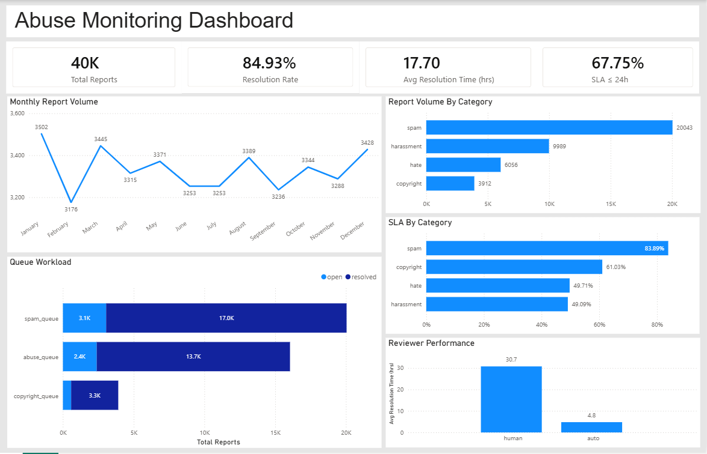
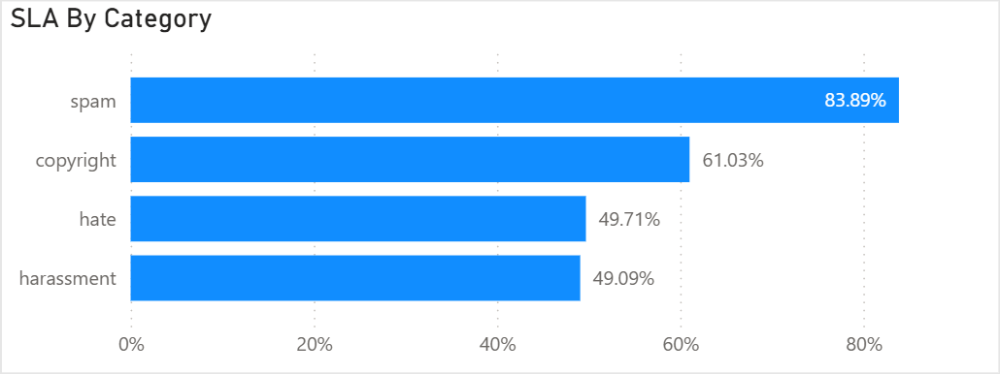
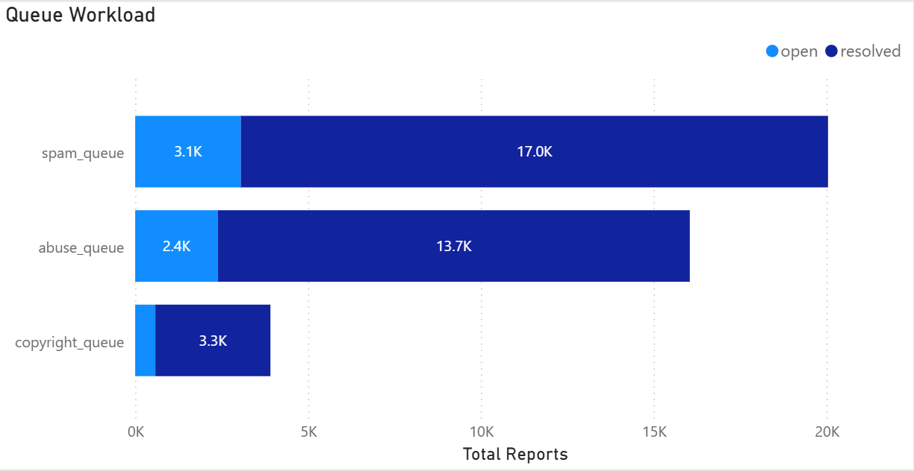
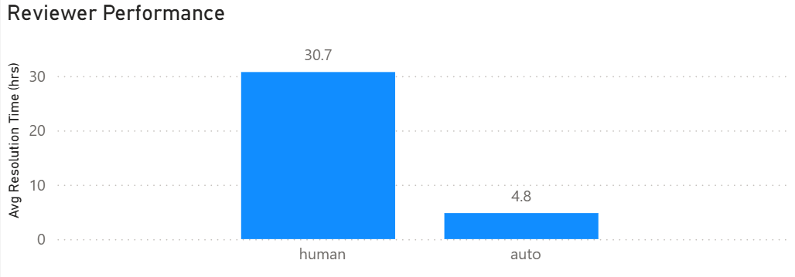

# Abuse Monitoring Analytics

## Dashboard Preview

### Full Dashboard

### SLA by Category

### Queue Workload

### Reviewer Performance

## Overview

## Overview

This project builds an operations analytics dashboard to monitor report volume, resolution efficiency, and workload distribution using SQL and Power BI.  
The goal is to transform raw event data into clear, actionable metrics that help track performance, identify bottlenecks, and support faster decision-making.

## Problem Statement

Large platforms receive high volumes of user reports that must be reviewed and resolved efficiently.  
Tracking workload, resolution speed, and operational performance manually can lead to delays, backlogs, and inconsistent service levels.  
This project builds an analytics dashboard to monitor report trends, measure review efficiency, and surface actionable insights for better operational decision-making.

## Dataset

A synthetic dataset of 40,000 abuse report records was generated to simulate operational workloads over one year.
Each record represents a single report ticket and includes fields such as report date, category, region, reviewer type, decision status, queue assignment, and resolution time in hours.

## Tools Used

- SQL (MySQL) — data querying and analysis  
- Power BI — dashboard design and visualization  
- Python — synthetic dataset generation
  
## Workflow

1. Generated a synthetic abuse reports dataset using Python  
2. Performed exploratory analysis and metric validation  
3. Loaded data into MySQL for structured querying  
4. Wrote SQL queries to compute operational and performance metrics  
5. Built an interactive Power BI dashboard to visualize insights
   
## Key Insights

- Spam reports form the majority of total volume and are resolved much faster compared to other categories  
- Human reviewers take several times longer than automated reviews on average  
- A small number of users generate a high number of reports, indicating repeat offenders  
- Some queues consistently handle more cases, creating heavier operational load  
- Resolution times differ by category, with harassment and hate-related reports taking longer to process
